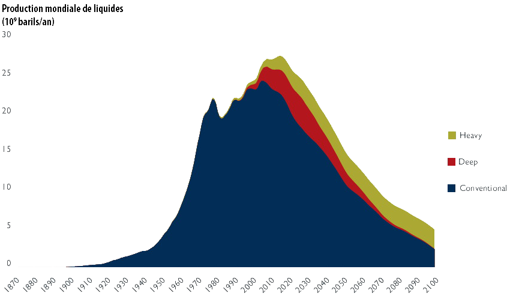
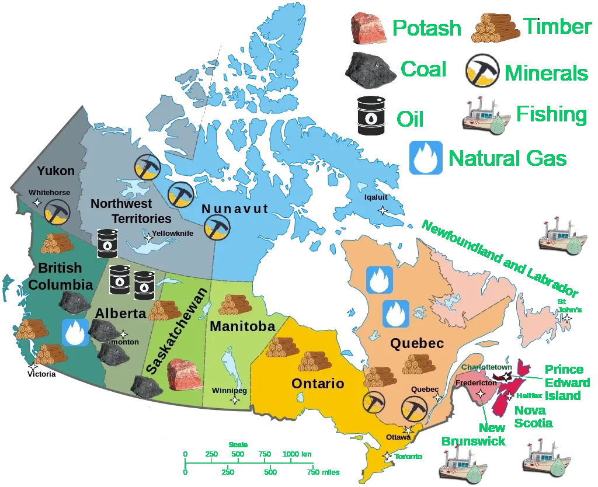


***Disclaimer***: *The following article represents my personal viewpoint, an attempt to understand and explain the current state of the world.*



<small><i>Inspired by observing global trends, I propose a hypothesis to interpret ongoing events. I apply a straightforward approach: formulate the simplest hypothesis that could explain observed phenomena and retain it until disproven or until a simpler, more compelling explanation emerges.
</i></small>


## Introduction

The debate surrounding resource scarcity—most notably through the lens of "peak
oil"—highlights the finite nature of critical resources such as oil, natural
gas, and rare earth elements. French energy expert Jean-Marc Jancovici
illustrates how resource extraction naturally peaks and then declines as
reserves diminish.

Explore Jancovici’s detailed perspective [here](https://jancovici.com/en/energy-transition/oil/when-does-the-world-oil-production-peak/).

Geologist Olivier Vidal extends this concept to rare earth metals, demonstrating
the impact of declining ore quality and rising extraction costs—critical
constraints for modern technologies:

<iframe width="560" height="315" src="https://www.youtube.com/embed/cUKSeZ4ATr8" frameborder="0" allow="accelerometer; autoplay; encrypted-media; gyroscope; picture-in-picture" allowfullscreen></iframe>

---

## The COVID Crisis: Preparing for Resource Constraints?

### COVID-19 Lockdowns

During the COVID-19 pandemic, stringent lockdowns had pronounced economic
consequences. A speculative interpretation is that such measures inadvertently
prepared societies for reduced mobility and energy consumption—perhaps
foreshadowing an era of limited resources. While intriguing, this theory remains
speculative and open to debate.

### Low-Emission Zones (ZFE)

In France, the establishment of Low-Emission Zones (ZFE) aims primarily at
reducing air pollution and greenhouse gas emissions. However, these zones also
implicitly encourage reduced overall energy consumption by limiting vehicle
use—a potentially intentional strategy amidst growing resource constraints.

---

## Global Warming as Policy Justification

Although the reality of human-induced climate change is widely accepted, I
question governments' genuine commitment to combating climate change if economic
competitiveness is at stake. Policies framed as climate measures might serve as
a pretext for managing resource scarcity through controlled carbon emissions and
energy usage.

---

## The War in Ukraine: A Resource Conflict?

The ongoing conflict in Ukraine is multifaceted, with territorial sovereignty
and geopolitical tensions dominating discussions. However, resource competition
is increasingly cited as a significant factor. Ukraine’s substantial rare earth
mineral deposits—reportedly over 50% of which lie in areas annexed or occupied
by Russia—add complexity to the geopolitical stakes.

Detailed analysis can be found in [The Independent’s recent coverage](https://www.independent.co.uk/news/world/europe/ukraine-minerals-deal-trump-zelensky-rare-earth-russia-b2709272.html).

---

## North American Ambitions: Trump's Controversial Claims

Following his 2024 presidential victory, Donald Trump’s provocative statements
regarding ambitions to annex Canada and Greenland—citing strategic resource
interests—have sparked controversy and intense debate. Although the feasibility
of such plans remains uncertain, the focus underscores growing geopolitical
interest in resource-rich territories.

Coverage by [CTV News](https://www.ctvnews.ca/world/trumps-tariffs/article/thats-enough-trump-shuts-down-talk-of-canada-during-news-conference-with-uk-pm/) highlights these controversial claims.

---

## Energy Efficiency: The DPE System

France’s Diagnostic de Performance Énergétique (DPE) assesses building energy
efficiency and greenhouse gas emissions. Poor ratings (F or G) impose rental
restrictions, incentivizing energy efficiency upgrades and conservation
efforts—illustrating another strategy to reduce resource consumption.

Comparable systems like the UK's Energy Performance Certificates (EPCs) reflect
similar objectives across Europe.

Further details available on the [official DPE page](https://www.economie.gouv.fr/particuliers/immobilier-diagnostic-performance-energetique-dpe).

---

## The 15-Minute City: Resource-Efficient Urban Planning

The "15-minute city" concept promotes neighborhoods where residents have
immediate access to essential services within walking or biking distance. Beyond
environmental benefits, this urban planning model efficiently addresses resource
scarcity by reducing dependency on energy-intensive transportation
infrastructure.

Learn more from [Wikipedia](https://en.wikipedia.org/wiki/15-minute_city).

---

## Digital Currencies: Balancing Innovation and Sustainability

The European Central Bank (ECB) explores the potential of a Digital Euro,
raising concerns about its environmental impact. Blockchain-based currencies,
particularly Proof-of-Work (PoW) systems, are energy-intensive, while
alternatives such as Proof-of-Stake (PoS) or centralized ledger systems offer
greater sustainability.

Annelieke A.M. Mooij (2022) argues that the ECB’s design choices must align with
EU climate goals, potentially influencing the structure toward more
energy-efficient models.

See the detailed analysis [here](https://www.cambridge.org/core/services/aop-cambridge-core/content/view/23A3E0D00334B06E557C137CEFA3598D/S2071832222000785a.pdf/digital_euro_and_energy_considerations_can_the_ecb_introduce_the_digital_euro_considering_the_potential_energy_requirements.pdf).

---

## Conclusion

Resource scarcity, environmental challenges, and geopolitical tensions are
deeply interconnected. Policies targeting climate change, energy efficiency, or
urban planning may simultaneously serve broader objectives: managing limited
global resources amidst rising constraints.


*Disclaimer: These views are personal interpretations containing speculative
elements. Readers should verify data through objective, peer-reviewed, and
official sources.*


